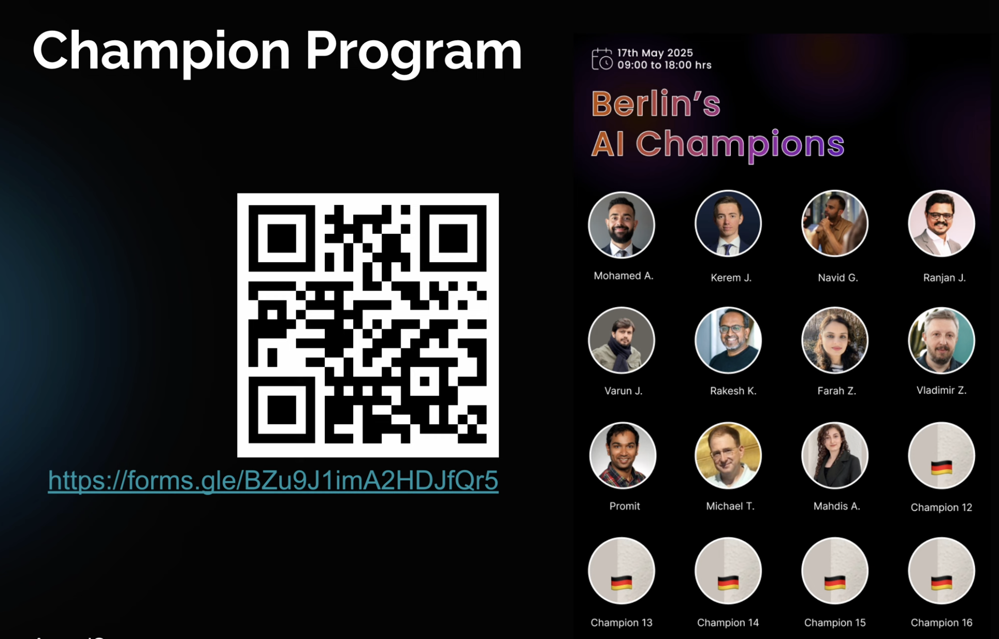
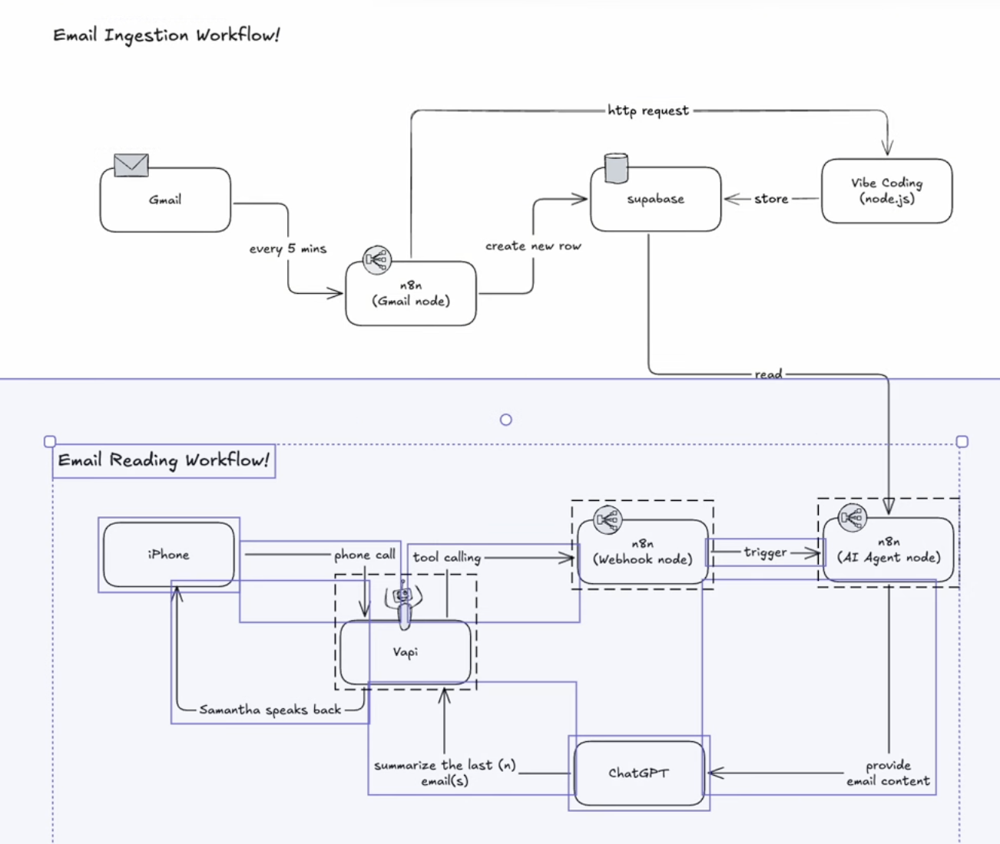
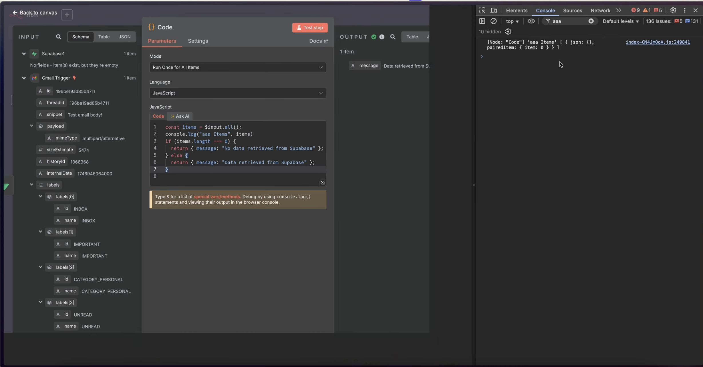

# AI Agent Lectures – Expert Summary

## Lecture 0101 – Quick Demo of What We Will Be Building
 This lecture introduces the course, explains the project objective (building a voice AI agent that interacts with your Gmail inbox), and outlines the structure of the workshop series. It describes the practical use cases, the agent's capabilities (reading and composing emails), and the tools you'll use (Vapi, n8n, custom coding). The instructor demonstrates how the agent can be triggered via Siri and used hands-free while driving, emphasizing accessibility and real-world application. No coding experience is required, but having some helps.
- 🎬 [Welcome and course intro](https://www.youtube.com/watch?v=4DIfI15BxTk&t=1)

 

## Lecture 0102 – The Monthly Workshop Concept
 This lecture details the monthly workshop structure, including the skills covered in each session and how participants can progressively build their own voice AI agent. The instructor shares the evolution of the workshop, the increasing number of participants, and the introduction of new features (Google Docs integration, Gmail skills, vibe coding, and AI search). Community-driven development is emphasized, with shoutouts to sponsors and "AI Champions" who help others during the event. Registration and participation logistics are explained, along with future plans for both in-person and online workshops.
- 🎬 [Workshop concept and history](https://www.youtube.com/watch?v=OzAUBijCGHs&t=0)
- 🎬 [Skill sets added: Google Docs, Gmail, vibe coding](https://www.youtube.com/watch?v=OzAUBijCGHs&t=16)
- 
- 🎬 [Crowd growth and logistics](https://www.youtube.com/watch?v=OzAUBijCGHs&t=60)
- 🎬 [Community, sponsors, and AI Champions](https://www.youtube.com/watch?v=OzAUBijCGHs&t=120)
- 
- 🎬 [How to register and join future workshops](https://www.youtube.com/watch?v=OzAUBijCGHs&t=200)

## Lecture 0103 – Introduction to Aemal Sayer
 In this lecture, Aemal Sayer introduces himself, sharing his background as a software engineer and entrepreneur. He discusses his experience building complex AI agents, founding multiple companies (including webRTC platforms, agencies, and voice AI products), and his transition into education and community leadership. Aemal highlights his technical expertise, language skills, and passion for helping others build practical AI solutions. He also explains the inspiration behind the course and his mission to make advanced AI accessible to everyone.
- 🎬 [About Aemal Sayer and his background](https://www.youtube.com/watch?v=sIAQ2nEhT_M&t=0)
- 🎬 [AI agent projects and company history](https://www.youtube.com/watch?v=sIAQ2nEhT_M&t=40)
- 🎬 [Mission: education and community](https://www.youtube.com/watch?v=sIAQ2nEhT_M&t=80)
- 🎬 [Real-world AI agent applications](https://www.youtube.com/watch?v=sIAQ2nEhT_M&t=120)

## Lecture 0201 – Intro to AI Agents
 Defines AI agents, their components (intelligence, memory, tool access), and how they differ from traditional software. Explores use cases (digital coworkers, automation) and future vision for digital coworkers in collaborative environments.

 
- 🎬 [Intro to AI Agents](https://www.youtube.com/watch?v=xBCK7yax2OA)

## Lecture 0202 – Intro to EU AI Act
 Overview of the EU AI Act, which classifies AI applications into four risk levels (minimal, limited, high, prohibited). Discusses the Act's purpose (protecting EU values) and implementation timeline (2025–2026).

 
- [Intro to EU AI Act](https://www.youtube.com/watch?v=w54dVbKEaI0)

## Lecture 0203 – AI Agent Frameworks
 Overview of frameworks and tools for building AI agents, including n8n, Relevance AI, Vapi, 11 Labs, Crew AI, Master AI, Vercel AI SDK, OpenAI Agents SDK, and Google Agent Development Kit. Highlights both low-code and code-first options, with EU compliance considerations.
- [AI Agent Frameworks](https://www.youtube.com/watch?v=jvPh7pumZ3I)

## Lecture 0300 – Basic Voice AI Agent Concepts
 Explains core voice AI agent concepts: VAD (Voice Activity Detection), EOU (End of Utterance), ASR (Automatic Speech Recognition), TTS (Text to Speech), LLM (Large Language Model). Describes the voice agent pipeline and importance of latency optimization for natural conversation.

- [Basic Voice AI Agent Concepts](https://www.youtube.com/watch?v=ZMalJ6omJEk)

## Lecture 0400 – Context Diagram
 Presents the context diagram for the app, illustrating the architecture and flow between components (Gmail, n8n, Vapi, custom code, databases, phone integration). Explains how the system processes emails, performs legal checks, and enables custom coding for advanced use cases.

 

 
- 🎬 [Context Diagram](https://www.youtube.com/watch?v=Lc2Bok6Xsk4)

## Lecture 0500 – Intro to Vapi and Co.
 Introduction to Vapi and alternative frameworks (e.g., LifeKit) for building voice AI agents. Discusses the evolution of these tools, open-source options, and why using a framework is typically better than building from scratch.
- 🎬 [Intro to Vapi and co.](https://www.youtube.com/watch?v=UyQrUx5P4x4)

## Lecture 0600 – Build Your First Voice AI Agent
 Step-by-step guide to building a voice AI agent using Vapi. Covers account setup, assistant creation, prompt engineering, voice selection, and basic configuration. Emphasizes practical setup and testing.
 
- 🎬 [Build your first Voice AI Agent](https://www.youtube.com/watch?v=2bi3aPBgTyc)

## Lecture 0700 – Introduction to n8n
 Introduction to n8n as a workflow automation framework, its features, open-source/fair-source model, and community. Covers workflow creation, nodes, triggers, templates, and execution logging.

 
- 🎬 [Introduction to n8n](https://www.youtube.com/watch?v=r44eGTnG4C4)

## Lecture 0800 – n8n AI Agent Node
 Demonstrates building a workflow in n8n using the AI agent node, covering node anatomy (input, properties, output), memory, chat triggers, and prompt engineering. Shows how to chain nodes and debug workflows.

 
- 🎬 [n8n AI Agent node](https://www.youtube.com/watch?v=xsG4aArgnXU)

## Lecture 0900 – Compose Email
 Demonstrates how to compose an email using NAT, focusing on workflow setup, trigger configuration, and integration with n8n.

 
- 🎬 [Compose email (intro)](https://www.youtube.com/watch?v=VhWujwS6gYo?t=4)
- 🎬 [Compose email – Draft step](https://www.youtube.com/watch?v=VhWujwS6gYo?t=77)
- 🎬 [Compose email – Draft result](https://www.youtube.com/watch?v=VhWujwS6gYo?t=432) <!-- Draft checked -->
- 

## Lecture 1000 – Webhooks in n8n
 Explains the concept of webhooks in n8n, including setup and their role in triggering workflows for automation.
 

 
- 🎬 [Webhooks in n8n (trigger explained)](https://www.youtube.com/watch?v=0EljcEJvWEQ?t=19)

## Lecture 1100 – Connecting Vapi to n8n
 Details the process of integrating Vapi with n8n, covering connection steps and practical use cases.

 
- 🎬 [Connecting Vapi to n8n (integration starts)](https://www.youtube.com/watch?v=wCUfCqNLsGs?t=3)

## Lecture 1200 – Complete Email Draft Workflow
 Outlines the workflow for drafting emails, emphasizing integration between tools and step-by-step execution in n8n.

 
- 🎬 [Complete email draft workflow (test starts)](https://www.youtube.com/watch?v=-m5a_Ry2PSE?t=8)
- 🎬 [Complete email draft workflow – Compose action](https://www.youtube.com/watch?v=-m5a_Ry2PSE?t=42)
- 🎬 [Complete email draft workflow – Recap](https://www.youtube.com/watch?v=-m5a_Ry2PSE?t=151)

## Lecture 1300 – Gmail on Message Received Trigger
 Shows how to configure n8n to trigger workflows upon receiving Gmail messages, enabling automated email processing.
 
- 🎬 [Gmail on message received trigger](https://www.youtube.com/watch?v=JE0yA9L86rM)

## Lecture 1401 – Caching Emails, with Blocker
 Introduces caching concepts for email workflows, discusses challenges in preventing duplicate storage using Supabase, and addresses common blockers in real-world scenarios.
 
- 🎬 [Caching emails, with blocker](https://www.youtube.com/watch?v=avIzxAp7D6c)

## Lecture 1402 – Problem with n8n If Node
 Examines issues encountered when using the If node in n8n, particularly with handling duplicate records during email ingestion and workflow execution.
- 🎬 [Problem with n8n if node](https://www.youtube.com/watch?v=UiDtl-5QXSU)

## Lecture 1403 – Solution with n8n Custom Code Node and Vibe Coding
 Presents a solution using n8n's custom code node and vibe coding techniques to overcome workflow limitations and enable advanced logic.
 

- 🎬 [Solution with n8n custom code node and vibe coding](https://www.youtube.com/watch?v=QMVN9-RKwSw)

## Lecture 1500 – Respond to Webhook Node in n8n
 Explains the role of the Respond to Webhook node in n8n, showing how it facilitates asynchronous workflow responses and improves user experience.

 
- 🎬 [Respond to webhook node in n8n](https://www.youtube.com/watch?v=BaahDeu3kz0)

## Lecture 1600 – Recap of Our Context Diagram
 Provides a recap of the context diagram, summarizing the overall architecture, completed steps, and next directions in the project.
- 🎬 [Recap of our context diagram](https://www.youtube.com/watch?v=kZkFVqj7hWc)

## Lecture 1700 – Create Read Email n8n Workflow
 Guides the creation of a workflow in n8n to read emails from Supabase, including aggregation and integration with external tools.

- 🎬 [Create read email n8n workflow](https://www.youtube.com/watch?v=TxHcpeEETdY)

## Lecture 1800 – Connect Vapi to n8n to Read Emails
 Shows how to connect Vapi to n8n for reading emails and enabling voice-based email retrieval and interaction.
 
 
- 🎬 [Connect Vapi to n8n to read emails](https://www.youtube.com/watch?v=I6cutdGAB-A)

## Lecture 1900 – Introduction to Vibe Coding
 Introduces the concept of vibe coding, its origins, and its relevance for AI agent development and rapid prototyping.
- 🎬 [Introduction to Vibe Coding](https://www.youtube.com/watch?v=SewB4tEgVpA)

## Lecture 2000 – Introduction to Replit, Lovable and Firebase Studio
 Briefly explores Replit, Lovable, and Firebase Studio, highlighting their features and how they support rapid development and integration for AI projects.

 ](image-25.png)
 
 
- 🎬 [Introduction to Replit, Lovable and Firebase Studio](https://www.youtube.com/watch?v=jh-X0BHZdgQ)

## Lecture 2100 – Introduction to Aemal Sayer's Vibe Coding 101 Crash Course
 Presents an overview of the Vibe Coding 101 Crash Course, the app built during the course, and key features such as real-time vibe sharing and workflow debugging.
- 🎬 [Introduction to Aemal Sayer's Vibe Coding 101 Crash Course](https://www.youtube.com/watch?v=tmTIFWjbN8k)

## Lecture 2200 – Spin-off a Node.js Service
 Demonstrates how to spin off a simple Node.js backend service, introducing Supabase edge functions and best practices for backend development in the AI agent context.
 
- [Spin-off a Node.js Service](https://www.youtube.com/watch?v=O8EJ2MF5JHk)

---

## Final Remarks

Well done! You have completed this amazing crash course where you learned how to build a voice agent that talks to your Gmail inbox. In the process, you learned how to use Vapi and n8n, and a little bit about vibe coding.

If you would like to attend one of my workshops, you can scan the QR code or go to the address provided to register for MetJune. It does not matter if you are based in Berlin or from around the globe—my workshops are happening in a hybrid format. I will live stream the event and also have some people in person. The next workshop is on the 17th of May, and we are expecting around 100 to 120 people in-house and over 380 people registered already, with many joining online as well.

I wish you good luck with your vibe coding and with your AI agent development journey. See you in the next tutorial. Bye!
